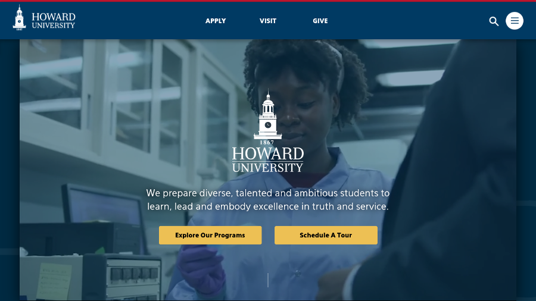
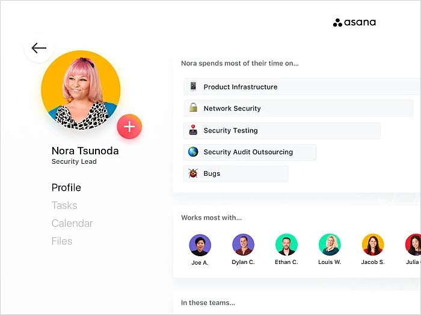
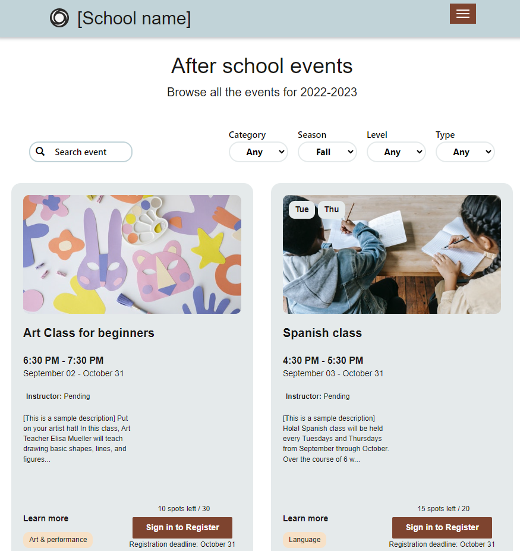

# Introduction

Manoa Compass is an application that allows users to:

* Register their UH Account.
* Create a user profile that details their major and event interest categories.
* Look at filtered events catered to their selected interests and major chosen by AI.

The problem we hope to solve with this application is the lack of awareness most students have about the events going on around campus. It's easy to just search up all the events happening around campus, but it can take forever to actually find ones that suit your interests and career path. Therefore, we want to make it easier for students to find specific events that meet their interests with our AI-integrated website.

## Technologies

To implement this website, we will be using various useful tools such as:

* React for component-based UI implementation and routing
* React Bootstrap for CSS Framework and UI Design
* Gemini API for event classifications and alignment with users

## Goals
As mentioned previously, our priority for this application is to create an event hub catered to students to help them get more involved with the events going on around campus whether they be social or career driven based on their interests and major. Our AI of our choosing will be used to understand the content of event descriptions, classify the event in terms of interest areas, ingest the event information into the events database and identify if the event that align with the interests specified in user profiles. The ability to view other events similar to, or outside of their liking, will be given too if students feel adventurous. If time permits, we also hope to incorporate notifications via email or text messaging to improve the quality of the service. Furthermore, we would also love to add a feedback function for users to make on events they've attended so other students can get an idea beforehand of how other students enjoyed them. 

# Mockup Pages

## Landing Page
The landing page will have a very simplistic yet user-interactive format with a similar layout to the one you see below. The NavBar will have pages like "Profile" and "Browse your Events"

## Sign In/Up
Our sign-up and sign-in pages will be extremely similar to the digits formatting because of its simplicity and so we can focus on other areas of the website more.

## Profile Page
The profile page should include a picture of the student and a list of their selected interest categories for events. The basic information that comes with a profile page is the username, email, major, and birthday.

## Browse Page
On this page, students will have the option to look through their AI-chosen events, all of the events currently in the UH Manoa Campus Events Calendar, or get events chosen for them.

