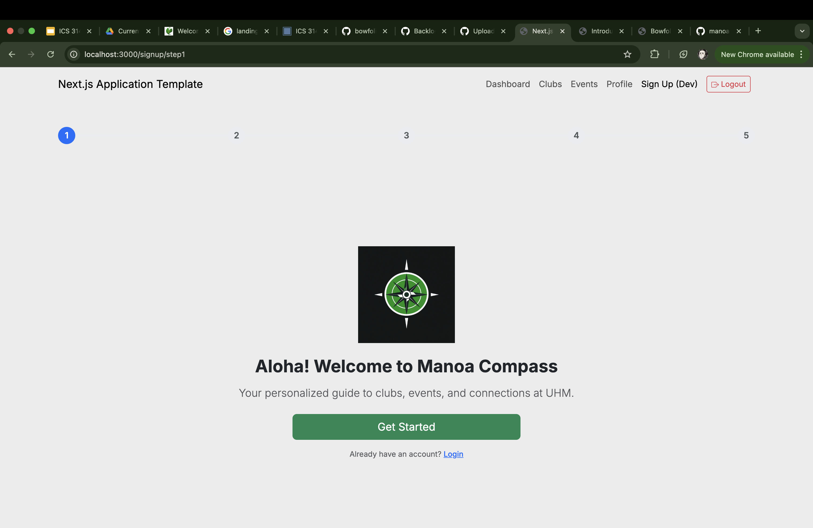

# Introduction

Manoa Compass is an application that allows users to:

* Register their UH Account.
* Create a user profile that details their major and event interest categories.
* Look at filtered events catered to their selected interests and major chosen by AI.

The problem we hope to solve with this application is the lack of awareness most students have about the events going on around campus. It's easy to just search up all the events happening around campus, but it can take forever to actually find ones that suit your interests and career path. Therefore, we want to make it easier for students to find specific events that meet their interests with our AI-integrated website.

## Technologies

To implement this website, we will be using various useful tools such as:

* **React** for component-based UI implementation and routing
* **React Bootstrap** for CSS Framework and UI Design
* **Gemini API** for event classifications and alignment with users

## Goals
As mentioned previously, our priority for this application is to create an event hub catered to students to help them get more involved with the events going on around campus whether they be social or career driven based on their interests and major. Our AI of our choosing will be used to understand the content of event descriptions, classify the event in terms of interest areas, ingest the event information into the events database and identify if the event that aligns with the interests is already specified in user profiles. The ability to view other events similar to, or outside of their liking, will be given too if students feel adventurous. If time permits, we also hope to incorporate notifications via email or text messaging to improve the quality of the service. Furthermore, we would also love to add a feedback function for users to make on events they've attended so other students can get an idea beforehand of how other students enjoyed them. 

# Mockup Pages

## Landing Page
The landing page is a simplistic yet user-interactive format with a similar layout to the one you see below. The NavBar will contain the other pages that go to the user's profile, events and clubs, or their dashboard showing all their chosen events.

## Sign Up
Our sign-up page will not only prompt the user for their email and a chosen password, but will also ask what their major, interests, name, age, etc. are to gather necessary information for the AI to match events/clubs to the user.

## Profile Page
The profile page should include a picture of the student and a list of their selected interest categories for events. The basic information that comes with a profile page is the username, email, major, and birthday. It also features the saved events and clubs that the user is a part of/wants to attend.

## Browse Page
On this page, students will have the option to look through their AI-chosen clubs, all of the clubs currently in the UH Manoa Campus Events Calendar, or get clubs chosen for them. We plan to implement a similar formatted page for events as well.

## Event Suggestion Page
The event suggestion page will suggest different events to attend based on your interests, along with other events that have a small overlap if you want to try something new. Clicking on one of the cards will either take you directly to the event page, or a custom event information page if we have time.

## Club and Event Information Pages
On these pages you can learn more about the event, including key details such as a summary of what it is, when, where, and times for activities. These will only be fully implemented if we have finished the base app.

# Team Contract
The team contract we all agreed upon can be viewed [here](https://docs.google.com/document/d/113gzfztCkZ03NJD8yignc65mnAk4yQBYTuVxveX-wl4/edit?tab=t.0)

# Deployment 

[Link to Manoa Compass in Vercel](https://manoa-compass-code.vercel.app/) 

# Milestone 1: Mockup Development

The goal of Milestone 1 was to create a set of HTML pages providing a mockup of the pages in the system.

Milestone 1 was managed using [Manoa Compass GitHub Project Board Milestone 1:]([https://github.com/orgs/manoa-compass/projects/1/views/1](https://github.com/orgs/manoa-compass/projects/2/views/1))

# Milestone 2 : Backend Development + AI Research

The goal of Milestone 2 is to make our website's backend for each page functionally correct and to dive into scraping the UH events and clubs in the school. Furthermore, one person will be dedicated to testing the AI and researching on how we can implement its functionality into our project.

Milestone 2 was managed using [Manoa Compass GitHub Project Board Milestone 2:](https://github.com/orgs/manoa-compass/projects/1/views/1)

# Project Schema

This is a flow of our project Schema, linking the user, club, and event attributes to the necessary components that allow our website to function as desired. 

